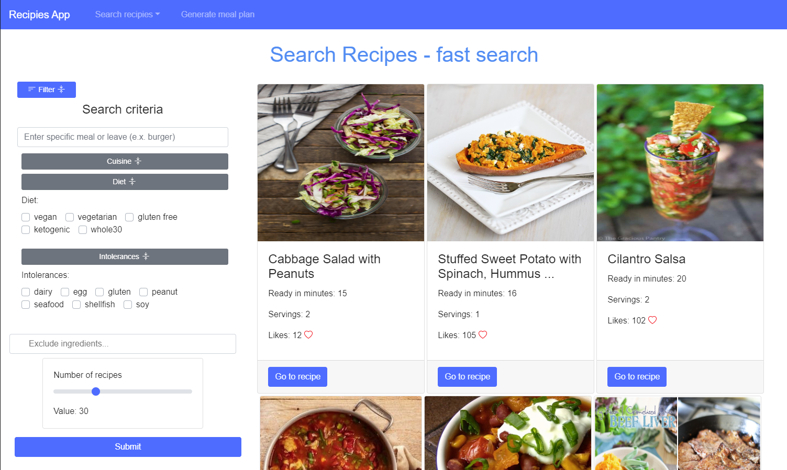
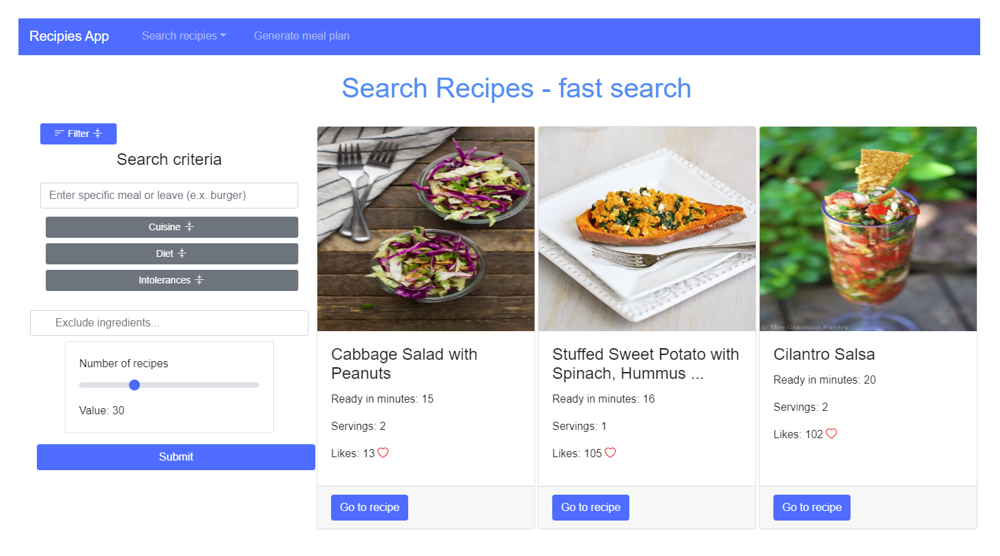
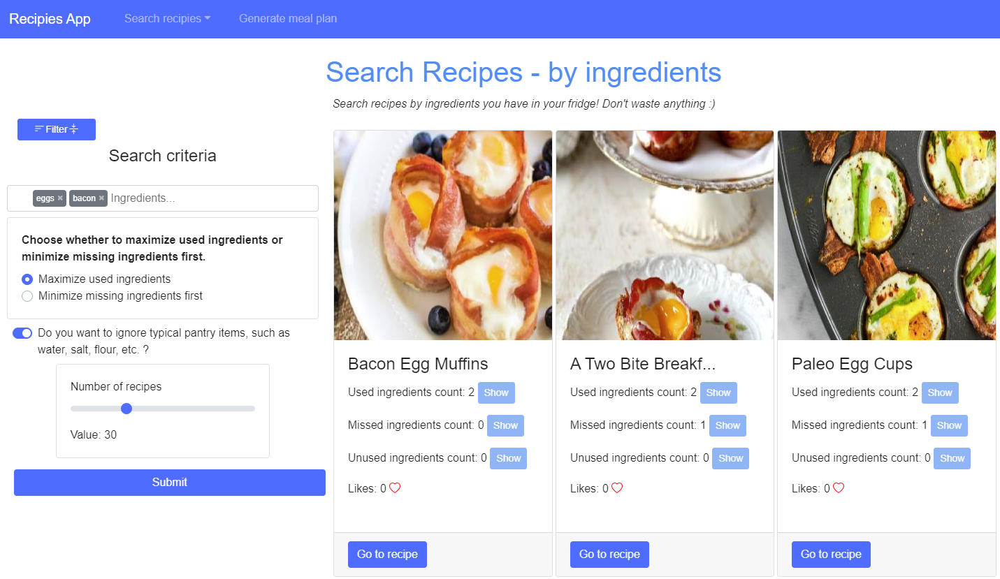
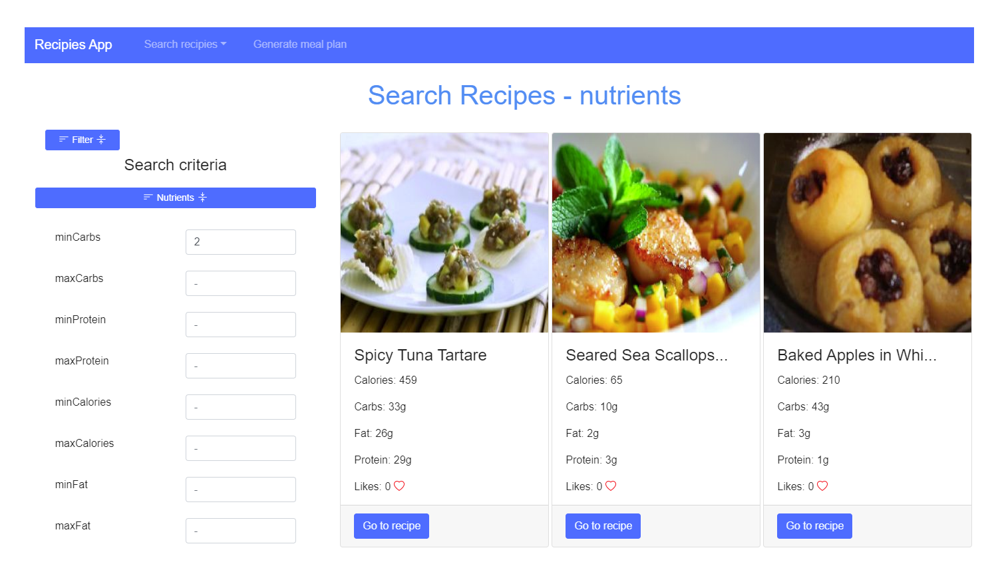
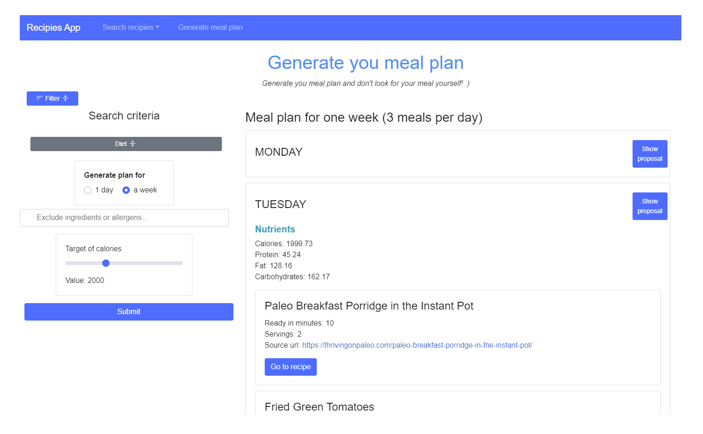
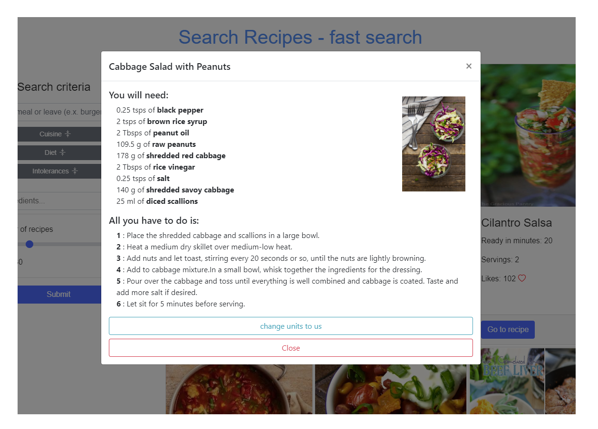

# Recipes App
## Spis Treści:
1. [Wstęp](#wstep)
2. [Funkcjonalność](#funkcjonalnosc)
    1. [Szybkie wyszukiwanie](#fast_search)
    2. [Wyszukiwanie po składnikach](#by_ingredients)
    3. [Wyszukiwanie po składnikach odżywczych](#by_nutrients)
    4. [Tworzenie planu odżywaiania](#meal_plan)
    5. [Karty przepisów](#recipe)
3. [Wykorzystane API](#stack)

 

# Wstęp
Aplikacja Recipies App służy do wyszukiwania przepisów kulinarnych według zadanych kryteriów. Kryteriami mogą być na przykład nazwy dań, kuchnia, dieta, nietolerancje, potrzebne składniki lub wartości odżywcze.
 
Dodatkowo aplikacja posiada możliwość wygenerowania planu z posiłkami na dzień lub cały tydzien, gdzie w każdym dniu przedstawione są 3 posiłki. Plan posiłków również może być spersonalizowany na przykład według ilości kalorii.
 
 

<i>Ekran główny aplikacji</i>

 

# Funkcjonalość

## Szybkie Wyszukiwanie

 Szybkie wyszukiwanie służy jednocześnie jako widok główny aplikacji. Podczas szybkiego wyszukiwania użytkownik może wpisać nazwę konkretnego posiłku i aplikacja zwróci przepisy, których nazwy zawierają podaną frazę. Jeśli nie zostanie podana żadna fraza to użytkownik otrzyma wyniki na podstawie reszty parametrów. Dostępne parametry to: kuchnia, dieta, nietolerancje, wykluczone składniki.

 

## Wyszukiwanie po składnikach

 Wyszukiwanie po składnikach pozwala użytkownikowi na wyszukiwanie przepisów za pomocą listy składników. Dodatkowo użytkownik może wybrać czy wyszukiwanie ma uwzględnić przepisy, które maksymalizują zużycie wybranych składników lub takie, które zminimalizują użycie brakujących. Ponad to użytkownik może ustawić by podstawowe składniki takie jak cukier lub mąka były pomijane przy filtrowaniu wyników.

 

## Wyszukiwanie po składnikach odżywczych

 Wyszukiwanie po składnikach odżywczych umożliwia użytkownikowi na filtrowanie wyników na ich podstawie. Wymagany jest przynajmniej jeden składnik podczas wyszukiwania, w przypadku braku podanych składników, użytkownik otrzyma powiadomienie o błędzie. Dostępne składniki do filtrowania wyników: Węglowodany, Proteiny, Kalorie, Tłuszcz, Cholesterol, Cukier.

 

## Tworzenie planu odżywiania

 Aplikacja posiada funkcjonalność polegającą na generowaniu plan posiłków dla użytkownika. Podczas tworzenia planu użytkownik może zdecydować według jakiej diety mają być dobierane posiłki oraz jakich składników lub alergenów wyszukiwarka ma unikać. Ponadto użytkownik może ustalić sumaryczną ilość kalorii na dany dzien oraz czy plan ma być generowany na cały tydzień czy tylko jeden dzień.

 

## Karty przepisów

 Główną funkcjonalnością aplikacji jest przedstawianie użytkownikowi przepisów. Przepisy są wyświetlane po wciśnieciu przycisku `Go to recipe` na karcie. Wyświetlony przepis informuje użytkownika o ilości składników, które można zamieniać pomiędzy jednostkami metrycznymi i amerkańskimi. Dodatkowo wyświetlane są kroki danego przepisu oraz wyświetlone jest zdjęcie dania.

 

## Wykorzystane API
W projekcie wykorzystane zostały następujące API:
* spoontacular - publiczne API dostarczające informacji na temat przepisów kulinarnych, na którym opiera się wyszukiwanie przepisów w aplikacji. API posiada wiele endpoint'ów, dzięki którym można uzyskiwać przepisy oraz udostępnia część funkcjonalności dla darmowych użytkowników. API jest dostępne pod witryną [spoonacular.com/food-api](https://spoonacular.com/food-api)

* restdb.io - API dostarczające NoSQL bazę danych. W naszej aplikacji jest wykorzystywana do przechowywania informacji o ilości polubień danych przepisów. API pozwala na stworzenie dowolnej bazy danych oraz udostępnia endpoint'y do wykonywania podstawowych poleceń na tabelach (SELECT, UPDATE, DELETE). API jest dostępne pod witryną [restdb.io/](https://restdb.io/)