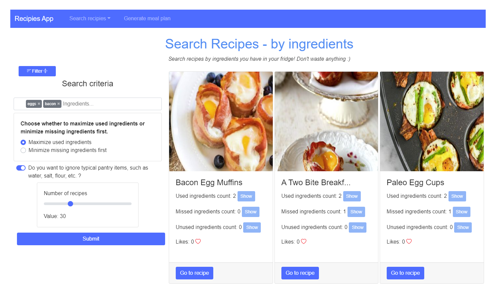

# Recipes App
## Spis Treści:
1. [Wstęp](#wstep)
2. [Funkcjonalność](#funkcjonalnosc)
    1. [Szybkie wyszukiwanie](#fast_search)
    2. [Wyszukiwanie po składnikach](#by_ingredients)

# Wstęp
Aplikacja Recipies App służy do wyszukiwania przepisów kulinarnych według zadanych kryteriów. Kryteriami mogą być na przykład nazwy dań, kuchnia, dieta, nietolerancje, potrzebne składniki lub wartości odżywcze.
 
Dodatkowo aplikacja posiada możliwość wygenerowania planu z posiłkami na dzień lub cały tydzien, gdzie w każdym dniu przedstawione są 3 posiłki. Plan posiłków również może być spersonalizowany na przykład według ilości kalorii.
 
 

<i>Ekran główny aplikacji</i>

# Funkcjonalość

## Szybkie Wyszukiwanie

 Szybkie wyszukiwanie służy jednocześnie jako widok główny aplikacji. Podczas szybkiego wyszukiwania użytkownik może wpisać nazwę konkretnego posiłku i aplikacja zwróci przepisy, których nazwy zawierają podaną frazę. Jeśli nie zostanie podana żadna fraza to użytkownik otrzyma wyniki na podstawie reszty parametrów. Dostępne parametry to: kuchnia, dieta, nietolerancje, wykluczone składniki.

 

## Wyszukiwanie po składnikach

 Wyszukiwanie po składnikach pozwala użytkownikowi na wyszukiwanie przepisów za pomocą listy składników. Dodatkowo użytkownik może wybrać czy wyszukiwanie ma uwzględnić przepisy, które maksymalizują zużycie wybranych składników lub takie, które zminimalizują użycie brakujących. Ponad to użytkownik może ustawić by podstawowe składniki takie jak cukier lub mąka były pomijane przy filtrowaniu wyników.

## test index
## test index
## test index
## test index
## test index
## test index
## test index

test anchor